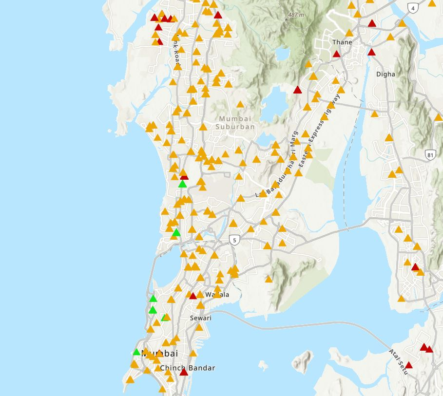

# Mumbai-Flood-risk-analysis

## 📌 Data Preparation

- Raw dataset contained real estate listings across Mumbai
- Cleaned and structured data using Excel
- Generated latitude and longitude coordinates from location data (geocoding)
- Created standardized address fields for mapping
- Engineered risk variables (Flood Risk, Cyclone Risk)
- Built loss estimation model based on exposure and risk scores

(Note: Full dataset not included in repository)

## 🌍 Geospatial Processing
- Converted location data into geographic coordinates (latitude & longitude) to enable spatial mapping in ArcGIS

## 🗺 Map Visualization

The map shows:
- Flood risk distribution across Mumbai (categorized as High, Medium, Low)
- Loss concentration using heatmap visualization

